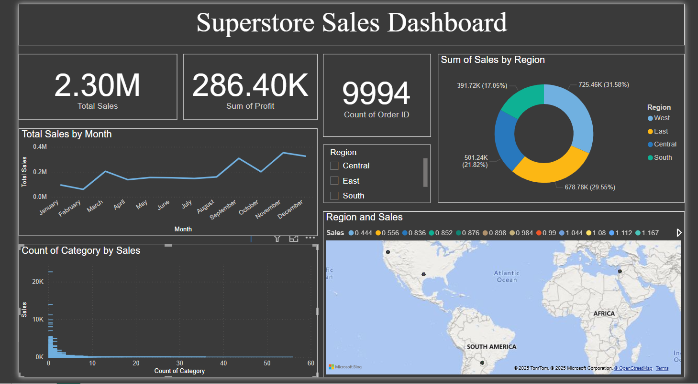

# Superstore Sales Dashboard 📊

An interactive dashboard created in Power BI to visualize and analyze Superstore sales data. The project aims to uncover insights into sales performance, profitability, and product trends across different regions.

## 🔍 Features
- Dynamic filtering by Region, Category, and Segment
- Key metrics: Total Sales, Profit, Discount, Quantity
- Drill-through and tooltip pages for deeper analysis
- Visual storytelling using bar charts, pie charts, and maps

## 📌 Tools Used
- Power BI
- DAX
- Excel (for preprocessing)

## 🖼️ Dashboard Preview

## 🎥 Project Demo

